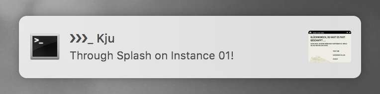
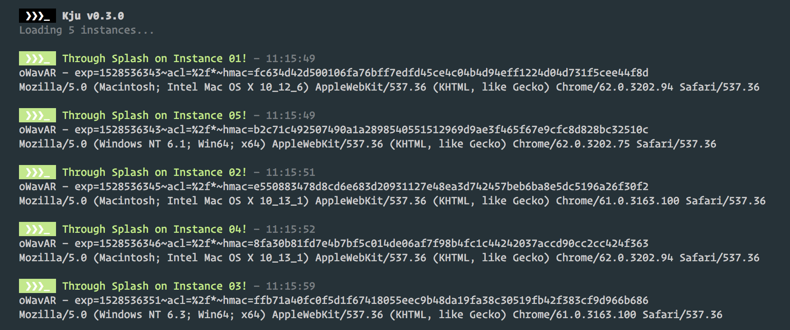

> Kju. Improved waiting time for the adidas.com splash page.

This is a script for people who don't want to deal with proxies for brute forcing the adidas.com splash page. There are a few similar scripts out there already, but this uses completely separate Chrome sessions for improved results. It is pretty heavy on the CPU though.

# Features

- Simple Command Line Tool
- All the right Chrome flags
- Headless mode
- HMAC cookie and User Agent Export
- Rich notification center integration

 

# Setup

### 1. Download and unzip.

### 2. Install Node.js.

   Download it form [here](https://nodejs.org/en/download/current/). Or do yourself a favor and use a package manager: [Homebrew](https://brew.sh) for macOS and [Chocolatey](https://chocolatey.org) for Windows.

   If you're feeling fancy, use Yarn instead of NPM.

### 3. Setup kju.

   Open your terminal and `cd` to the `kju` folder. Install the dependencies with `npm install` or `yarn install`.

   In the meantime, log into your Google account on Chrome and export all your cookies with the [EditThisCookie](https://chrome.google.com/webstore/detail/editthiscookie/fngmhnnpilhplaeedifhccceomclgfbg) extensions into a file called `cookie.json` in the `kju` folder.

   Open `config.js` and edit it to your liking.

# Usage

Start Kju as soon as splash goes live. It handles 20 instances on a 13'' MPB (2016) without problem. Adjust accordingly.

Press `l` to toggle logging in the terminal. Press `c` to copy the latest HMAC and User Agent.

Once an instance passes splash, clicking on the notification takes you to that specific browser window. Cart and checkout from there.

You can also export the HMAC to [InstaCop](https://github.com/bequadro/instacop) on your regular browser. Make sure to set the corresponding User Agent there, e.g. via Chrome's DevTools (Network Conditions) or Safari's developer menu.

# Support

I will provide absolutely no support regarding setup and usage.

Try Twitter or [r/adidasATC](https://reddit.com/r/adidasATC).

# Resources

- [Comprehensive list of Chromium command line switches](https://peter.sh/experiments/chromium-command-line-switches/)
- [Dynamically updated list of UserAgents](https://techblog.willshouse.com/2012/01/03/most-common-user-agents/)

# Contributing

Someone test this on Windows please.

# Contact

- [bequadro](https://twitter.com/_bequadro)
